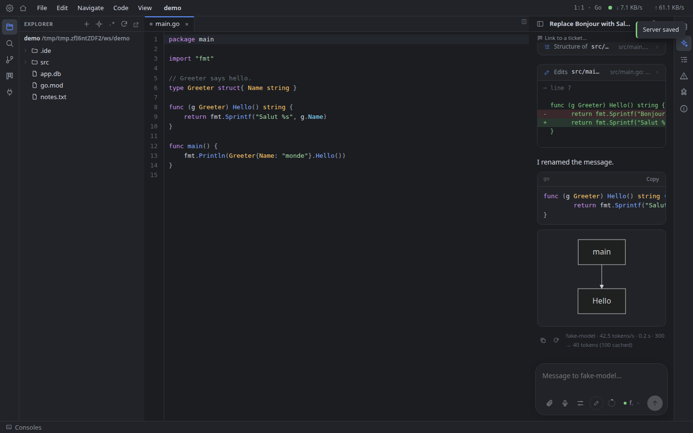
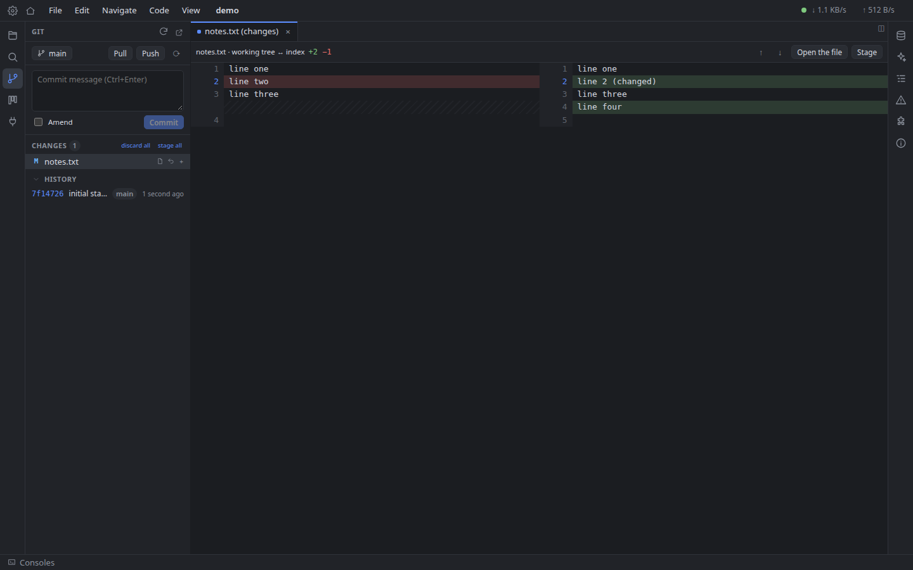

# Web IDE

*[Version française](README.fr.md)*

A self-hosted IDE that runs in your browser, backed by a small local agent — the **pod** — that gives it what a web page cannot have: your disk, SSH, terminals, language servers, databases, git and local AI models.

- **One binary.** The pod is a single Go executable with the web app embedded. No Electron, no cloud, no account.
- **Local first.** Everything (settings, projects, sessions, conversations) is stored by the pod in `~/.web-ide` and in the project's `.ide` folder. Private keys and audio never leave your machine.
- **Same session everywhere.** Open the IDE from another browser or another machine connected to the same pod and find your tabs, splits, cursors and terminals as you left them.






## Features

- **Editor** — fast block rendering (100,000-line files), syntax highlighting with the CSS Custom Highlight API (Go, PHP, JavaScript, TypeScript, Python, nginx…), split panes sharing buffers, find in file and project-wide search, sub-word navigation, QWERTY and AZERTY shortcut presets, themes.
- **Safe with other tools** — when an AI agent or any program changes an open file, the change is merged into your buffer (three-way merge); real conflicts open a three-pane resolution dialog.
- **Code navigation** through language servers (gopls, intelephense, pyright, typescript-language-server…): definition, references, implementations, symbols, completion, rename, formatting, diagnostics.
- **Local and SSH projects** — the same features on a remote host over SSH/SFTP, with your local keys.
- **Terminals and commands** in a bottom panel, detachable into their own windows.
- **Git** — status, staging, commits, branches, history, side-by-side diffs, gutter markers.
- **Database explorer** — SQLite, PostgreSQL and Redis, SQL console with transactions, table view, optional SSH tunnels.
- **AI assistant** for llama.cpp and Ollama servers: an agent that reads, searches and edits the project, uses the language servers, runs commands, asks you questions, follows `CLAUDE.md` / `AGENTS.md` instructions and skills, with Plan / Build modes, automatic context compaction, Mermaid diagrams, image / PDF / audio attachments and local speech-to-text (Whisper in the browser).
- **Kanban per project** — tickets go from briefing to plan to development to testing with linked assistant conversations; each ticket in development gets its own git branch and worktree, opened in its own window, with its diff, merge and rebase. See [docs/kanban.md](docs/kanban.md).
- **English and French** interface.

## Requirements

- Linux or macOS (developed on Linux).
- To build: Go 1.27+, Node.js 20.19+ and npm.
- Optional: `git`; language servers in the pod's `PATH` (`gopls`, `intelephense`, `pyright`, `typescript-language-server`); a [llama.cpp](https://github.com/ggml-org/llama.cpp) or [Ollama](https://ollama.com) server for the assistant.

## Quick start

```sh
git clone https://github.com/DrSmithFr/web-ide.git
cd web-ide
make build
./bin/web-ide-pod
```

The pod prints a URL such as `http://127.0.0.1:4433/?token=…`. Open it once: the token is stored in a cookie and pairs the browser with the pod (it is also in `~/.web-ide/token`).

Options: `-addr` (listen address), `-workspace` (default folder for new projects, `~/Apps`), `-data` (data folder, `~/.web-ide`), `-allow-remote` (accept other machines), `-static` (serve the front end from a folder).

To start the pod with your session, install it as a systemd user service:

```sh
make service   # binary in ~/.local/bin, service web-ide-pod
journalctl --user -u web-ide-pod   # shows the URL with the token
```

## Security

The pod has the rights of the user running it: it reads and writes files, runs commands and opens SSH connections on your behalf. By default it only accepts connections from the local machine, and every request needs the pairing token. With `-allow-remote` the token is the only protection: use it on a trusted network only, or behind a TLS reverse proxy. See [SECURITY.md](SECURITY.md).

## Development

```sh
make dev    # pod on :4433 (with -allow-remote) + Vite dev server with hot reload on :5173
make test   # go vet, Go tests, TypeScript check
make e2e    # browser tests (headless Chromium from the Playwright cache, or CHROME=/path/to/chrome)
```

Read [docs/architecture.md](docs/architecture.md) for the code layout and [CONTRIBUTING.md](CONTRIBUTING.md) before opening a pull request.

## License

[MIT](LICENSE)
