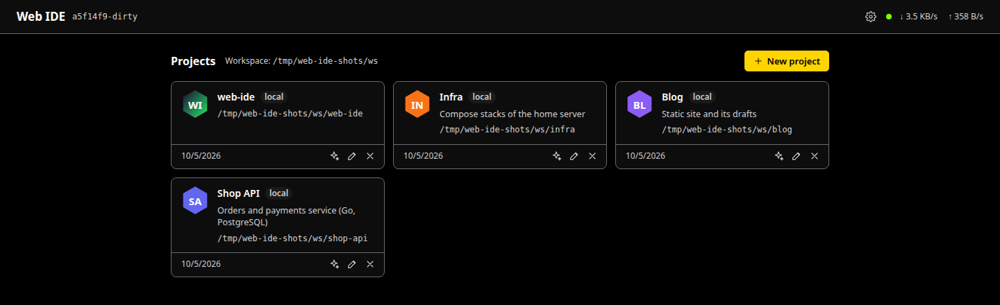
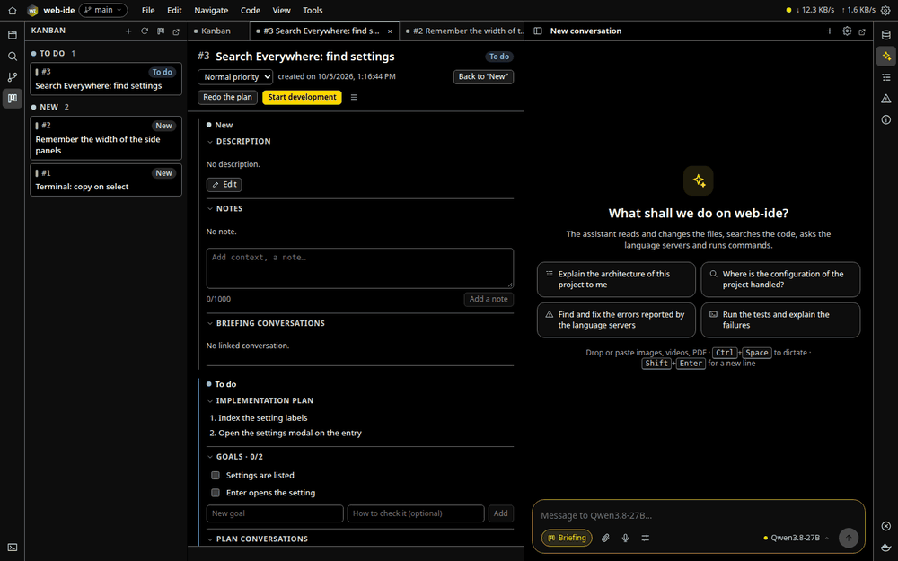
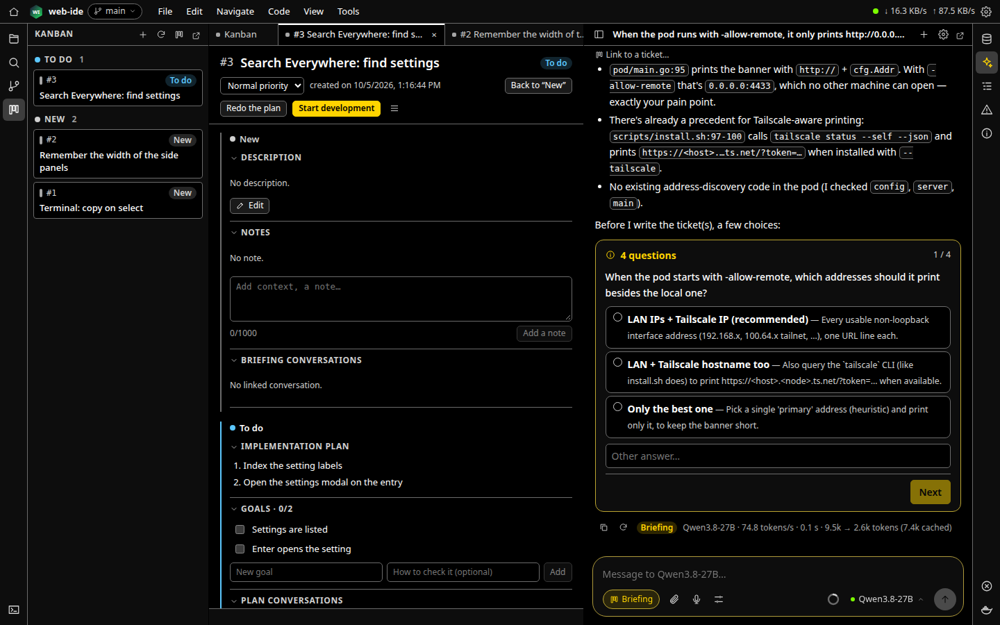
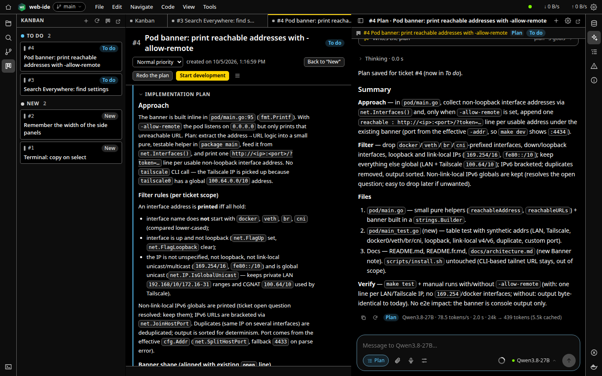
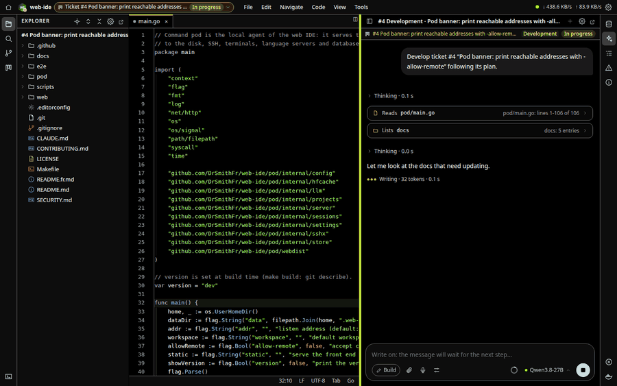
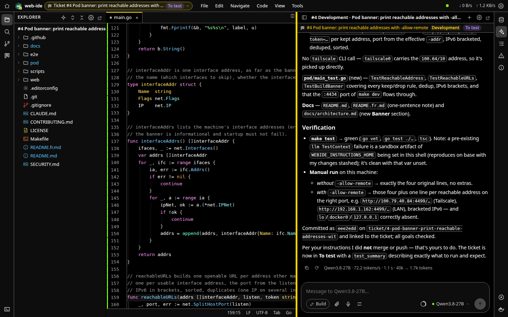
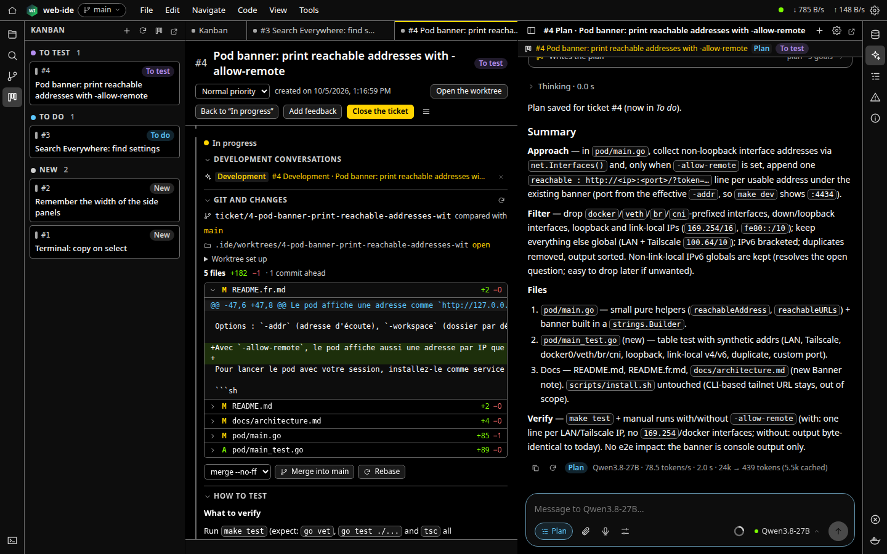
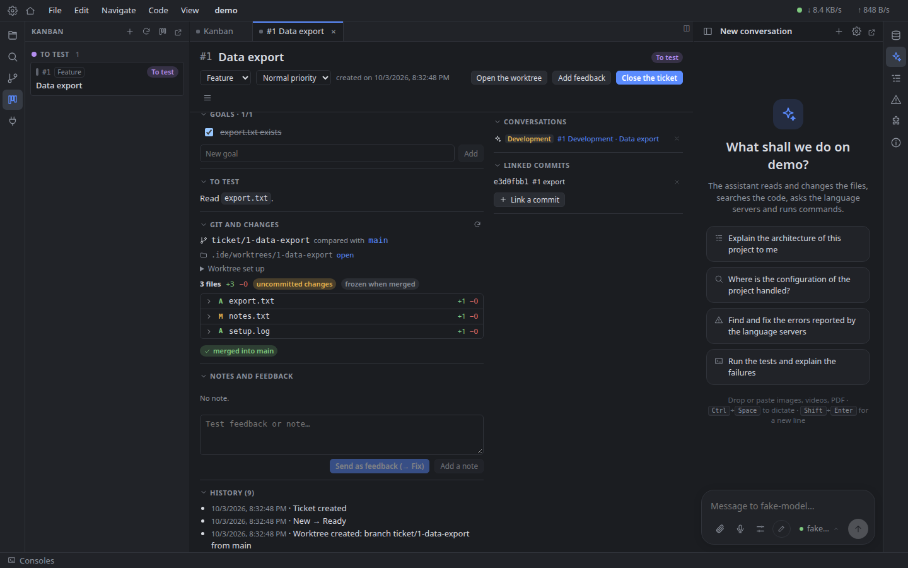
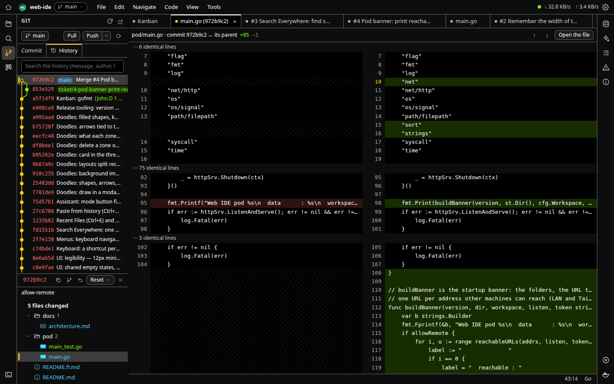
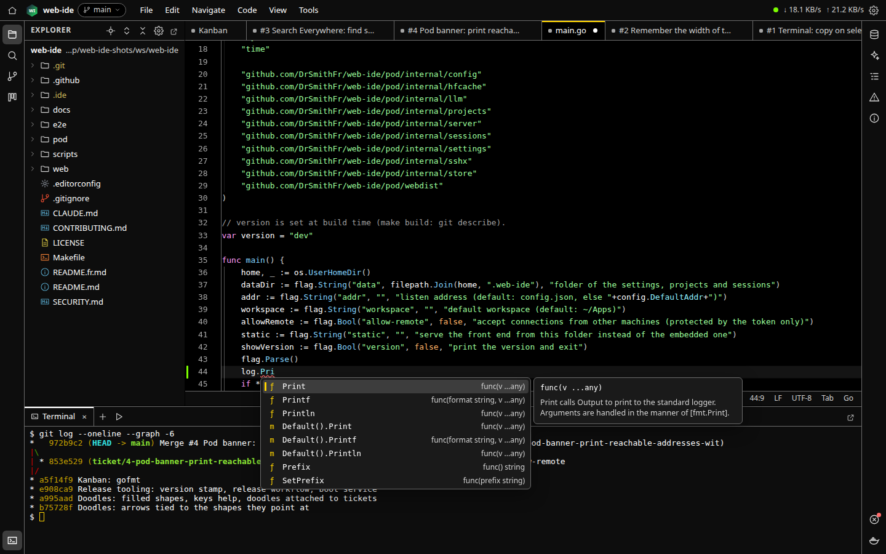

# Guide d'utilisation

*[English version](guide.md)*

Installer Web IDE, brancher un modèle, et mener une modification de l'idée à la branche fusionnée avec l'assistant et le kanban. Les images sont faites sur ce dépôt par `make shots` (voir [Mettre à jour les images](#mettre-à-jour-les-images)).

- [Installation](#installation)
- [Projets](#projets)
- [Brancher un modèle](#brancher-un-modèle)
- [Le cycle de développement](#le-cycle-de-développement)
  1. [Briefing : de l'idée au ticket](#1-briefing--de-lidée-au-ticket)
  2. [Plan](#2-plan)
  3. [Développement dans un worktree](#3-développement-dans-un-worktree)
  4. [Test, retours, fusion](#4-test-retours-fusion)
- [Travailler à la main](#travailler-à-la-main)
- [Où sont les données](#où-sont-les-données)
- [Mettre à jour les images](#mettre-à-jour-les-images)

## Installation

Web IDE est un seul programme, le **pod**, qui sert l'interface à votre navigateur et fait le travail sur votre machine (fichiers, git, terminaux, serveurs de langage, appels au modèle).

### En service (Linux)

```sh
curl -fsSL https://raw.githubusercontent.com/DrSmithFr/web-ide/main/scripts/install.sh | sh
```

Le script télécharge la dernière version dans `~/.local/bin/web-ide-pod` et installe un service utilisateur systemd lancé au démarrage, avant même que vous ouvriez une session (il active le *lingering* de votre utilisateur). Il affiche l'adresse à ouvrir, avec le jeton d'appairage :

```
Open: http://127.0.0.1:4433/?token=…
```

Ouvrez-la une fois : le jeton passe dans un cookie et appaire ce navigateur. Le jeton est aussi dans `~/.web-ide/token`.

- Une version donnée : `… | sh -s -- v1.0.0`. Relancer le script met le pod à jour et garde vos données.
- État et journaux : `systemctl --user status web-ide-pod`, `journalctl --user -u web-ide-pod`.
- Le service garde le `PATH` du shell qui l'a installé : le pod trouve `git`, `go`, `node` et vos serveurs de langage. Relancez le script après avoir installé des outils ailleurs.

### Depuis d'autres machines : Tailscale

Le pod ne répond qu'à la machine locale. Pour l'utiliser depuis un portable, un téléphone ou une tablette, servez-le sur votre réseau [Tailscale](https://tailscale.com) :

```sh
… | sh -s -- --tailscale
```

Le script lance `tailscale serve`, qui donne au pod une adresse HTTPS avec un vrai certificat, comme `https://mon-pc.mon-tailnet.ts.net/?token=…`, joignable depuis tous les appareils du tailnet, à la maison comme ailleurs. Le HTTPS compte : les navigateurs ne donnent le micro (dictée) et le presse-papier qu'aux pages sécurisées. Si `tailscale serve` est refusé, autorisez votre utilisateur une fois avec `sudo tailscale set --operator=$USER`.

### Depuis les sources

```sh
git clone https://github.com/DrSmithFr/web-ide.git && cd web-ide
make build && ./bin/web-ide-pod     # dans le terminal
make service                         # ou cette version comme service
```

Il faut Go 1.27+ et Node.js 20.19+. Options du pod : `-addr`, `-workspace` (dossier par défaut des nouveaux projets, `~/Apps`), `-data` (`~/.web-ide`), `-allow-remote` (HTTP simple vers d'autres machines, jeton seul : préférez Tailscale), `-version`.

## Projets



La page d'accueil liste vos projets et les dossiers de l'espace de travail pas encore ajoutés : cliquez pour ouvrir. Un projet est un dossier local ou un dossier sur un hôte SSH (mêmes fonctions, avec vos clés SSH locales). Chaque projet a une icône, générée depuis son nom et modifiable.

Un projet s'ouvre dans sa propre fenêtre et revient tel que vous l'avez laissé, dans tout navigateur relié au même pod : onglets, découpages, curseurs, terminaux.

## Brancher un modèle

L'assistant parle à [llama.cpp](https://github.com/ggml-org/llama.cpp) (`llama-server`, aussi en mode routeur) ou [Ollama](https://ollama.com), sur votre machine ou votre réseau : ouvrez l'assistant (barre de droite), *Add a model server*, donnez son adresse. Choisissez le modèle dans la zone de saisie. Le modèle et son modèle de chat doivent gérer les appels d'outils (`llama-server --jinja`).

Les images de ce guide sont faites avec Qwen3.8 27B sur llama.cpp.

## Le cycle de développement

Chaque projet a un kanban. Un ticket passe par quatre étapes, chacune avec sa conversation de l'assistant liée :

| Étape | Ce qui se passe | Qui |
|---|---|---|
| **New** | Le besoin est clarifié et écrit | Une conversation *Briefing* vous interroge et écrit le ticket |
| **To do** | Le plan d'implémentation et ses objectifs | *Generate the plan* : le modèle lit le code et les écrit |
| **In progress** | Le code, sur sa branche et son worktree | *Start development* : le modèle code, teste et commite |
| **To test** | Vous vérifiez ; les retours repartent au modèle | Vous, puis des *Fix sessions* ; enfin fusion et clôture |

C'est vous qui faites passer le ticket d'une étape à l'autre ; le modèle travaille à l'intérieur d'une étape.

### 1. Briefing : de l'idée au ticket



Ouvrez l'assistant et passez-le en mode **Briefing** (Maj+Tab alterne Build, Plan et Briefing). Décrivez le besoin en quelques mots. Dans ce mode le modèle ne modifie rien : il lit le code pour comprendre le contexte, puis pose ses questions une à une, avec des réponses suggérées :



Quand le besoin est clair, il écrit le ticket (ou plusieurs) dans le kanban : description, critères d'acceptation, fichiers liés. La conversation reste liée au ticket.

### 2. Plan



Sur le ticket, *Generate the plan* lance une conversation en mode Plan : le modèle lit le code concerné et écrit le plan d'implémentation et les objectifs, chacun avec sa façon de le vérifier. Le ticket passe en **To do**. Modifiez le plan ou les objectifs au besoin, ou *Redo the plan*.

### 3. Développement dans un worktree



*Start development* crée la branche `ticket/<n>-<slug>` et son worktree git dans `.ide/worktrees/`, y lance la commande de préparation des réglages du kanban (`npm install`, copie d'un `.env`…) et l'ouvre dans sa propre fenêtre, où le modèle se met au travail :

- il suit le plan et les instructions du projet (`CLAUDE.md`, `AGENTS.md`, skills) ;
- il lit, cherche, modifie les fichiers, utilise les serveurs de langage et lance des commandes (build, tests) ;
- il coche les objectifs un à un et commite sur la branche du ticket (messages commençant par `#<n>`) ;
- à la fin, il passe le ticket en **To test** avec la façon de le tester.

Votre dossier principal n'est jamais touché : vous pouvez continuer à y travailler, ou développer plusieurs tickets à la fois. Suivez le travail en direct, répondez à ses questions, ou arrêtez-le et réorientez-le à tout moment.



### 4. Test, retours, fusion



En **To test**, le ticket montre comment tester, les objectifs, et la modification par rapport à sa branche de base, fichier par fichier. Testez dans la fenêtre du worktree (ses terminaux, ses commandes). Puis :

- **Add feedback** (bug, info ou nouvelle fonctionnalité) pour ce qui ne va pas : *Fix session* envoie un retour ou tous au modèle, qui les corrige dans le worktree et les marque traités.
- **Rebase** sur la branche de base quand elle a bougé ; les conflits sont listés avec *Continue*, *Abort* et une *Resolution session* pour le modèle.
- **Merge** dans la branche de base locale (`merge --no-ff` ou squash), ou *Create the pull request* (avec `gh`).
- **Close** : le worktree est supprimé, la branche est gardée.

Un gros changement se découpe en **lignée** : les étapes suivantes sont des tickets dont le parent est le premier (le briefing le propose, ou *En faire une étape de…* dans la section *Lignée* d'un ticket). Chaque étape se développe dans le même worktree une fois la précédente validée (*Valider l'étape* sur le premier ticket, *Close* sur une étape), et le premier ticket est fusionné quand toutes ses étapes sont terminées. Un ticket peut aussi attendre qu'une autre lignée soit fusionnée ; un ticket bloqué montre ce qu'il attend, et *Démarrer quand même…* passe outre. La vue *Feuille de route* du tableau montre les lignées en lignes de blocs aussi larges que leur taille : on voit ce qui peut démarrer et l'ampleur du travail à venir.





## Travailler à la main

Tout ce que fait le modèle, vous pouvez le faire vous-même, dans les mêmes fenêtres :



- **Éditeur** : découpages, multi-curseur (Alt+J occurrence suivante, Alt+Maj+glisser ou bouton du milieu pour les colonnes), repli, recherche et remplacement, Search Everywhere (Maj deux fois), Recent Files (Ctrl+E), le switcher (Ctrl+Tab), historique du presse-papier (Ctrl+Maj+V).
- **Serveurs de langage** (gopls, typescript-language-server, pyright, intelephense…, dans le `PATH` du pod) : définition, références, complétion, renommage, formatage, diagnostics.
- **Terminaux** dans le panneau du bas (Ctrl+Maj+`), détachables dans leur propre fenêtre.
- **Git** : modifications, index, commits, branches, graphe de l'historique, diffs côte à côte, autres worktrees.
- **Bases de données** (SQLite, PostgreSQL, Redis), **Docker** (stack Compose, conteneurs, journaux) et tunnels SSH.
- Quand un programme (le modèle, un formateur, un autre éditeur) modifie un fichier ouvert, la modification est fusionnée dans votre buffer ; un vrai conflit ouvre une fenêtre à trois volets.

Tous les raccourcis sont dans *Settings → Keyboard*, avec les dispositions QWERTY et AZERTY.

## Où sont les données

- `~/.web-ide/` : réglages (avec leur historique), projets, sessions, serveurs de modèles, secrets (mode 0600), jeton d'appairage.
- `<projet>/.ide/` : conversations (`chats.db`), kanban (`kanban.db`), worktrees des tickets, connexions aux bases, marques de dossiers, icône. Son propre `.gitignore` garde les bases et les worktrees hors de git.
- L'audio et les clés privées ne quittent jamais votre machine.

Pour travailler sur Web IDE lui-même, `make dev` lance un pod séparé (port 4434, données dans `~/.web-ide-dev`) à côté de celui installé : voir [CONTRIBUTING.md](../CONTRIBUTING.md).

## Mettre à jour les images

```sh
make shots                         # rejoue les conversations enregistrées
node e2e/shots/shots.cjs record    # les enregistre à nouveau avec un vrai modèle (LLM_URL, LLM_MODEL)
```

Le scénario (`e2e/shots/shots.cjs`) clone ce dépôt au commit de l'enregistrement, joue tout le cycle ci-dessus dans un Chromium sans écran et écrit les fichiers PNG et GIF dans `docs/images`. Les réponses du modèle sont rejouées depuis `e2e/shots/recording.json.gz` : les images peuvent suivre l'interface sans modèle.
